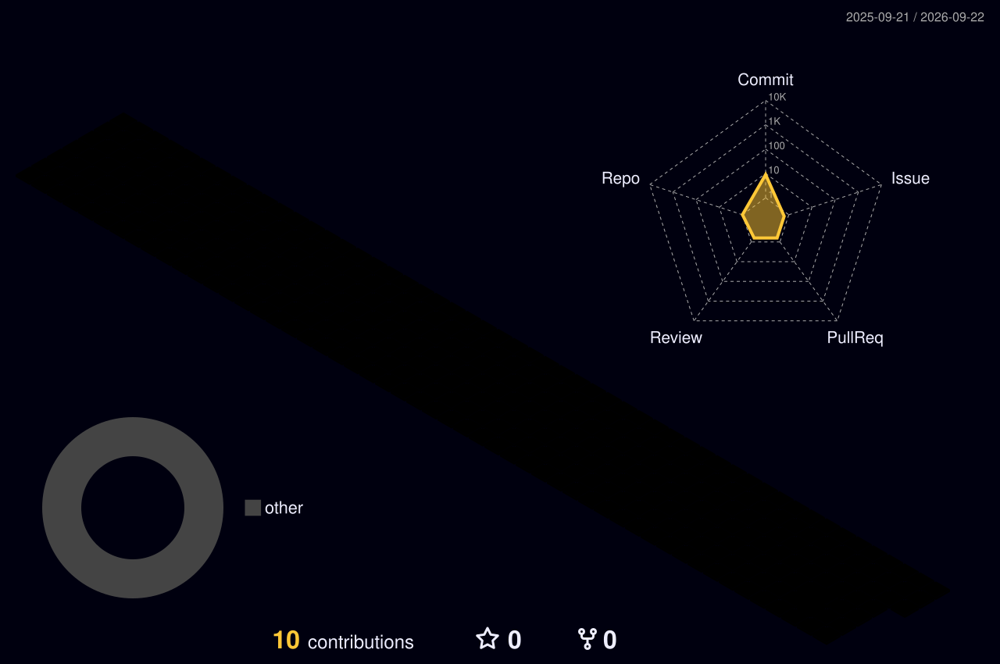

<!-- ═══════════════════════════════════════════════════════════════
     SAURABH KUMAR · GitHub Profile Dashboard
     Theme: Neon Cyber Dark  ·  Best viewed in GitHub Dark Mode
     ═══════════════════════════════════════════════════════════════ -->

<div align="center">

<!-- ░░░ 3D HEADER BANNER ░░░ -->


<!-- ░░░ ANIMATED TYPING LINE ░░░ -->
<a href="https://100rab.online">
  
</a>

<br/>

<!-- ░░░ NEON SOCIAL RAIL ░░░ -->
<a href="https://100rab.online"></a>
<a href="https://linkedin.com/in/100rab"></a>
<a href="mailto:ssdshiner@gmail.com"></a>
<a href="https://instagram.com/wizard.100rab"></a>

<br/><br/>


</div>


##  &nbsp; `whoami`

```yaml
name:        Saurabh Kumar
alias:       100rab
role:        Legal & Operations Lead — AeroSync Digital Technologies Pvt. Ltd.
base:        IIT Madras Research Park, Chennai, Tamil Nadu
origin:      Kochas, Rohtas — Bihar

domains:
  - Corporate law, incorporation & statutory compliance
  - Bookkeeping, payroll & early-stage finance
  - Financial modelling & data analysis
  - Web operations, technical SEO & UI/UX
  - AI-assisted workflow design & prompt engineering

studying:
  - CA Intermediate      # ICAI · in progress
  - MBA (Marketing)      # Andhra University · pursuing
  - B.Com (Hons.)        # AISECT University · completed

philosophy: "Continuous learning, purposeful growth, self-reliance
             across every critical business discipline."
```


##  &nbsp; 3D Contribution Skyline

<div align="center">

<!-- Auto-generated daily by .github/workflows/profile-3d.yml -->


<br/>

<!-- Auto-generated by .github/workflows/snake.yml → output branch -->


</div>


##  &nbsp; Command Center

<div align="center">


<br/>


</div>


##  &nbsp; Tech Arsenal

<div align="center">

**Build &amp; Ship**


**Data, Design &amp; Ops**


<br/>

**Daily Drivers**


</div>


##  &nbsp; Currently Building

<div align="center">
<table>
<tr>
<td width="50%" valign="top">

### 🏘️ &nbsp;KochasWala
`kochas.in` · multilingual local platform

A whole town brought online — businesses, food,
events, photos and community for **Kochas,
Rohtas (Bihar)**. Runs in four separately-written
languages: English, Hindi, Bhojpuri and Hinglish.

 

</td>
<td width="50%" valign="top">

### 🛰️ &nbsp;SyncXR
`AeroSync Digital` · VR aerospace platform

Founding-team work on a **VR design-review
platform for aerospace** — plus the outbound
sales CRM behind it, built on Sheets + Apps
Script + Graph API.

 

</td>
</tr>
<tr>
<td width="50%" valign="top">

### 📚 &nbsp;StudySync Pro
`personal build` · study tracker

A study-tracker web app built around the CA
Intermediate grind — syllabus mapping, revision
cycles and honest hour-counting.


</td>
<td width="50%" valign="top">

### 📈 &nbsp;Growth Tracker
`personal build` · habits &amp; goals

Personal growth dashboard — habits, goals and
weekly reviews, because discipline needs
receipts, not vibes.


</td>
</tr>
</table>
</div>


##  &nbsp; Track Record

<details open>
<summary><b>&nbsp;💼&nbsp; Experience</b></summary>
<br/>

| Period | Role | Where |
|:---|:---|:---|
| `2025 → now` | **Legal & Operations Lead** — bookkeeping, payroll, web ops, compliance, investor documentation | AeroSync Digital Technologies |
| `2026 → now` | **Financial Coordination & Documentation** — finance coordination, legal registrations | Skillveri |
| `2025` | **Advisor, Legal & Finance** — incorporation, GST setup, statutory filings | AeroSync Digital Technologies |
| `2022 – 2024` | **Teacher** — Financial Literacy, Computer Science, Economics, Mass Media (Classes 6–10) | Rohtas Public School |
| `2020 – 2022` | **SEO Coordinator & Web Consultant** — site architecture, technical SEO, UI/UX, content ops | Freelance |

</details>

<details>
<summary><b>&nbsp;🎓&nbsp; Education</b></summary>
<br/>

| Qualification | Institution | Status |
|:---|:---|:---|
| **Chartered Accountancy** | ICAI | Foundation cleared *(Distinction — Corporate Law)* · Intermediate in progress |
| **MBA (Marketing)** | Andhra University | Pursuing |
| **B.Com (Hons.)** | AISECT University, Hazaribag | Completed |

</details>

<details>
<summary><b>&nbsp;📜&nbsp; Certifications</b></summary>
<br/>


</details>


<div align="center">

##  &nbsp; Let's Build Something

**Open to** — finance &amp; compliance collaborations · AI-workflow experiments · local-tech projects for Bihar

<a href="mailto:ssdshiner@gmail.com"></a>
<a href="https://linkedin.com/in/100rab"></a>

<br/><br/>

> *"Commerce graduate with a zeal for tech — learning in public, shipping in private, compounding either way."*


</div>
